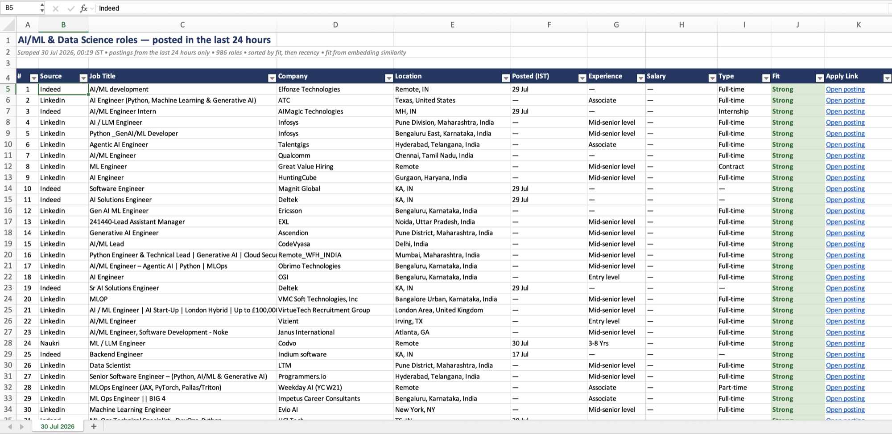

# 🎯 Job Hunt AI

**An open-source, agentic AI job-search copilot for students and early-career engineers.**

▶️ **[Watch the live demo](https://www.linkedin.com/posts/mohit-chauhan-ab5396365_aiagents-opensource-langgraph-ugcPost-7486499407060713472-Ie_T)** — the pipeline running end to end, from scrape to tailored cover letter.

Job hunting is a numbers game where the slow part isn't clicking "Apply" — it's *finding* fresh relevant postings every day, figuring out which ones actually fit you, and tailoring your resume + cover letter for each one. Job Hunt AI automates exactly that slow part with a team of AI agents, and leaves the final click to you.

<p align="center">
  
</p>

Built with **LangGraph**, **LangChain**, **FAISS**, **Scrapling**, and **FastAPI** — with a clean web dashboard to run the pipeline and track every application from *prepared* → *applied* → *interviewing* → *offer*.

## ✨ What it does

- **Scout Agent** — scrapes fresh postings from LinkedIn + Indeed (via [jobspy](https://github.com/Bunsly/JobSpy)) and Naukri (via [Scrapling](https://github.com/D4Vinci/Scrapling), whose self-healing selectors survive site markup changes), deduplicated across sources. Company career-page listings only expose a title and a link, so each of those postings is fetched through [Jina Reader](https://jina.ai/reader) (free, no API key, public pages only) to recover its real description — matching quality depends entirely on that text. Parses your resume PDF into structured data with an LLM (cached, so it only costs one call).
- **Matcher Agent** — three-stage matching: free local FAISS embeddings filter out the noise, a dedicated Nemotron reranker (free, off the generation budget) narrows that shortlist to the most relevant few, then an LLM reads each one against your resume and scores fit 0–100 (catching hard requirements embeddings miss, like "8+ years required"). Fit-scoring calls run concurrently, bounded by `LLM_CONCURRENCY`.
- **Tailor Agent** — for each match above your threshold, writes a tailored resume summary, re-worded bullet points, missing ATS keywords, and a full cover letter — kits are generated concurrently instead of one at a time. **It never invents experience** — it only re-words and emphasises what's genuinely on your resume.
- **Review Crew** — a skeptical "hiring manager" persona critiques each cover letter, then an "editor" persona rewrites it. Kills the generic AI-slop tone. Each kit's critique→edit exchange runs alongside the others, not sequentially.
- **Applier Agent** — saves each application kit as Markdown in `output/applications/`, records it in a SQLite tracker, and notifies you (console, Slack, or email).
- **Web dashboard** — run the pipeline, browse matches with fit scores, read/copy your tailored materials, and move applications through the funnel.
- **Automatic LLM fallback** — every agent calls one `get_llm()` factory. If your primary provider (Gemini/OpenAI/Bedrock) errors or hits a rate limit mid-run, the call transparently retries against a free OpenRouter model instead of failing the run.

## 🖱️ Why it doesn't auto-submit applications

Auto-filling forms on LinkedIn/Naukri/Indeed violates their Terms of Service and gets accounts banned — the worst possible outcome mid job-hunt. Recruiters also increasingly filter obviously-botted applications. This project's philosophy: **automate the research and writing (the slow part), keep the human on the final click (the risky part).**

## 🚀 Quickstart

**Prerequisites:** Python 3.10+, a free [Gemini API key](https://aistudio.google.com)

```bash
# 1. Clone and install
git clone https://github.com/<your-username>/job-hunt-ai.git
cd job-hunt-ai
python -m venv venv && source venv/bin/activate   # Windows: venv\Scripts\activate
pip install -r requirements.txt
scrapling install       # downloads the headless browser Scrapling uses for Naukri

# 2. Configure
cp .env.example .env
#    → open .env and paste your GOOGLE_API_KEY

# 3. Add your resume
cp /path/to/your/resume.pdf data/resume.pdf

# 4. Verify setup
python main.py check

# 5. Launch the dashboard
python main.py serve          # → http://localhost:8000
```

Set your target roles and locations in `config.py` (`JOB_PREFERENCES`), or override them per-run from the dashboard.

You can also run headless (great for a daily cron job):

```bash
python main.py run
```

## 📅 Daily job spreadsheet

Scrape today's postings into a dated `.xlsx` — every role scraped, scored against your resume, sorted by fit then recency, with a clickable link per row.

<p align="center">
  
</p>

<p align="center"><em>A real run — 986 roles from LinkedIn, Indeed and Naukri, deduplicated, ranked, and banded by fit.</em></p>

```bash
python main.py sheet ~/Desktop          # → ~/Desktop/Jobs-2026-07-29.xlsx
python main.py sheet ~/Desktop --hours 48
python main.py sheet ~/Desktop --llm-top 15   # real LLM scores for the top 15
```

This is **not** the full pipeline. `run` tailors a resume and cover letter per match, costing an LLM call each — fine for the handful you'll actually apply to, wasteful across 600+ scraped roles. So the sheet ranks with the free half of the matcher, and the LLM only gets involved with `--llm-top`. A default daily run costs nothing beyond the scrape.

Ranking is a two-stage split, and the split is deliberate. FAISS embeddings score every posting, then the free Nemotron cross-encoder re-orders the top `SHEET_RERANK_POOL` (default 200). Measured on a real 650-job scrape with planted controls:

| | FAISS rank | + reranker |
|---|---|---|
| Planted perfect-match ML role | 42 | **1** |
| Planted nurse / accountant / chef | 648 / 652 / 649 | 648 / 652 / 649 |

The reranker is much better at ordering the top but noticeably *worse* at burying obvious noise — scoring the whole set with it put a chartered-accountancy job at 237/654, where FAISS had it at 652. (The model is the **VL** variant, tuned for visual document retrieval, which likely explains the weak text-only rejection.) So each stage does what it's good at: FAISS rejects, the reranker orders. Set `ENABLE_SHEET_RERANK=false` to use embeddings alone.

The `Fit` column bands the result into **Strong / Reachable / Stretch**. On reranked runs the score is a **percentile within that day's batch** — 90 means "top 10% of what was scraped today" — because the cross-encoder's raw relevance lands in a tiny, query-dependent range (0.0003–0.015 on real postings) that carries no absolute meaning. Either way it's a triage signal, not a verdict: only `--llm-top` reasons about hard requirements like "8+ years required".

**Run it automatically at noon, every day:**

```bash
sed -e "s|__PROJECT_DIR__|$PWD|g" \
    -e "s|__PYTHON_BIN__|$(which python3)|g" \
    -e "s|__OUTPUT_DIR__|$HOME/Desktop|g" \
    scripts/com.jobhuntai.dailysheet.plist.template \
    > ~/Library/LaunchAgents/com.jobhuntai.dailysheet.plist
launchctl bootstrap gui/$(id -u) ~/Library/LaunchAgents/com.jobhuntai.dailysheet.plist
```

macOS only. `launchd` rather than `cron` because it runs a job it missed once the Mac wakes, where cron silently skips anything scheduled while the machine was asleep. Output goes to `logs/daily-sheet.log`, and a failed run raises a desktop notification rather than failing silently. On Linux, point cron at `scripts/daily_sheet.sh` instead:

```bash
0 12 * * * /path/to/job_hunt_ai/scripts/daily_sheet.sh
```

Set `JOB_ROLES` and `JOB_LOCATIONS` in `.env` (comma-separated) so your real search preferences stay out of the repo.

**A scrape that returns nothing is treated as a failed run.** If every source comes back empty, the run exits non-zero and writes no file, leaving the existing sheet intact — an empty result is nearly always a network outage or a broken scraper, not an empty job market, and overwriting good data with a header row is the worse failure. Set `SHEET_ALLOW_EMPTY=true` if an empty result is genuinely expected.

On macOS, keep the project **out of `~/Desktop`, `~/Documents` and `~/Downloads`.** Those folders are TCC-protected: a scheduled `launchd` job can't read them, so the agent dies with `Operation not permitted` before your script starts — and because the failure happens at exec, nothing in the script gets a chance to warn you. `~/job_hunt_ai` or `~/Projects/job_hunt_ai` work fine.

## 🗂️ Project structure

```
job_hunt_ai/
├── agents/                  # the four pipeline agents
│   ├── scout_agent.py       #   parse resume + scrape jobs
│   ├── matcher_agent.py     #   FAISS pre-filter + reranker + LLM fit scoring
│   ├── tailor_agent.py      #   tailored summary/bullets/cover letter
│   └── applier_agent.py     #   save kits, track, notify
├── graph/
│   ├── state.py             # shared pipeline state (TypedDict)
│   └── pipeline.py          # LangGraph wiring: scout→match→tailor→review→apply
├── tools/
│   ├── resume_parser_tool.py  # PDF → structured ParsedResume (LLM)
│   ├── scraper_tool.py        # jobspy + Scrapling scrapers (self-healing)
│   ├── vector_store_tool.py   # FAISS index over job embeddings
│   └── notifier_tool.py       # console / Slack / email
├── review/
│   ├── autogen_crew.py      # reviewer+editor cover-letter polish
│   └── tracker.py           # SQLite application tracker
├── exports/
│   └── daily_sheet.py       # dated .xlsx of everything scraped today
├── scripts/
│   ├── daily_sheet.sh       # scheduled-run wrapper (env + logging)
│   └── com.jobhuntai.dailysheet.plist.template   # launchd: noon daily
├── api/server.py            # FastAPI backend
├── frontend/                # dashboard (vanilla JS — no build step)
├── config.py                # settings + LLM factory
└── main.py                  # CLI: check | run | sheet | serve
```

## 💸 Cost

Designed to run on **free tiers**:

- Embeddings are local ([all-MiniLM-L6-v2](https://huggingface.co/sentence-transformers/all-MiniLM-L6-v2)) — $0, private, offline.
- LLM calls per run are capped: 1 resume parse (cached) + ~8 fit scores + ~8 tailoring calls + ~16 review calls. On Gemini Flash's free tier this costs **nothing**; on paid tiers it's pennies per run.
- The reranker cut fit-scoring calls roughly in half — before it existed, all ~15 FAISS-shortlisted candidates went to the paid LLM step; now a free reranker pass narrows that to ~8 first.

## ⚡ Performance

Matcher's fit-scoring, Tailor's kit generation, and Review's critique→edit exchange all run their LLM calls concurrently — bounded by `LLM_CONCURRENCY` (default `4`) — instead of one call at a time. Measured live against OpenRouter's free Nemotron tier:

| Stage | Calls/run | Sequential | Concurrent (×4) | Speedup |
|---|---|---|---|---|
| Matcher — fit-scoring | 8 | ~31s | ~18s | **1.7×** |
| Tailor — kit generation | 8 | ~4.6 min | ~1.8 min | **2.5×** |
| Review — critique + edit* | 8 kits (16 calls) | ~54s | ~19s | **2.9×** |
| **Total (LLM-bound stages)** | — | **~6.0 min** | **~2.4 min** | **~2.5×** |

\* Review wasn't benchmarked directly — estimated from Matcher's measured per-call latency, since a critique/edit call is a similar shape to a fit-score call.

Two more changes are easy to lump in with "performance" but solve a different problem:

- **The reranker is about cost, not speed.** Its own call takes ~9s once — the win is narrowing the field before the expensive LLM step runs, not making that step faster.
- **The OpenRouter/Nemotron fallback is about not failing, not about speed.** It only activates when your primary provider errors or rate-limits; on the happy path it adds zero overhead. It turns "the run crashes" into "the run finishes, a little slower."

These numbers come from a live n=4 benchmark per stage on free-tier infrastructure — your actual latency will depend on provider, prompt size, and network conditions. If your provider's rate limits allow it, raising `LLM_CONCURRENCY` compounds these gains further.

## 🐳 Docker

```bash
cp .env.example .env   # fill in your key
docker compose up --build
# → http://localhost:8000
```

See [DEPLOYMENT.md](DEPLOYMENT.md) for cloud options (Railway, Render, Hugging Face Spaces) and daily scheduling.

## ☁️ Enterprise deploy — Amazon Bedrock AgentCore

The same crew runs serverless on AWS with one flag. Because every agent calls a single `get_llm()` factory, setting `LLM_PROVIDER=bedrock` moves the whole pipeline to **Claude on Amazon Bedrock** — then AgentCore Runtime adds serverless scaling, session isolation, memory, and observability, with a **Managed Knowledge Base** replacing the FAISS layer and platform **Guardrails** enforcing the no-fabrication rule.

```bash
pip install -r requirements.txt -r requirements-bedrock.txt
python provision_bedrock.py                       # create the Guardrail
agentcore configure --entrypoint job_hunt_agent.py
agentcore launch --env LLM_PROVIDER=bedrock --env GUARDRAIL_ID=... --env GUARDRAIL_VERSION=...
```

Full walkthrough: [BEDROCK.md](BEDROCK.md).

## 🤝 Contributing

This project exists to help students land jobs — contributions are very welcome! Good first issues:

- Add a scraper for your region's job board (Internshala, Wellfound, Instahyre…)
- Add company career-page configs in `tools/scraper_tool.py`
- Improve the fit-scoring prompt
- Add resume export (tailored PDF generation)

See [CONTRIBUTING.md](CONTRIBUTING.md) for setup and guidelines.

## ⚖️ Responsible use

- Scrapers include polite rate-limiting — keep it that way.
- Respect each platform's Terms of Service; don't add auto-submission features.
- The tailor agent is prompt-constrained to never fabricate experience. A resume that lies gets you blacklisted; keep it honest.

## 📄 License

[MIT](LICENSE) — free to use, modify, and share.

---

*Built by a student, for students. If it helped you land an interview, star the repo so others find it.* ⭐
